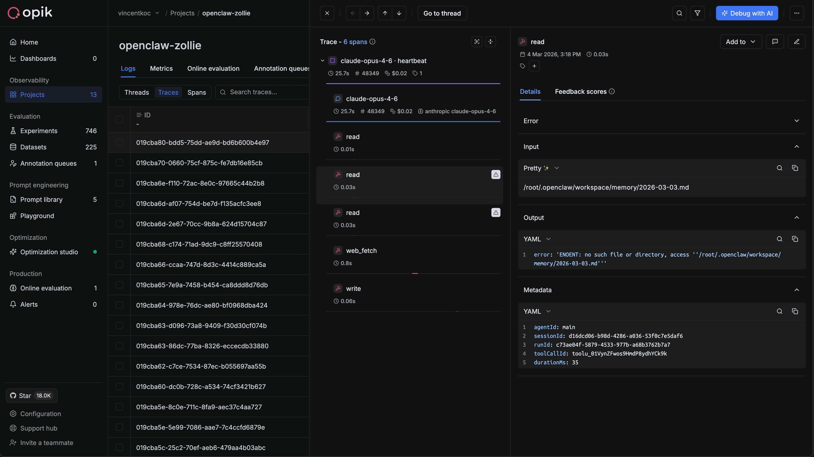

<h1 align="center" style="border-bottom: none">
  <div>
    <a href="https://www.comet.com/site/products/opik/?from=llm&utm_source=opik&utm_medium=github&utm_content=header_img&utm_campaign=opik">
      <picture>
        <source media="(prefers-color-scheme: dark)" srcset="https://raw.githubusercontent.com/comet-ml/opik/refs/heads/main/apps/opik-documentation/documentation/static/img/logo-dark-mode.svg">
        <source media="(prefers-color-scheme: light)" srcset="https://raw.githubusercontent.com/comet-ml/opik/refs/heads/main/apps/opik-documentation/documentation/static/img/opik-logo.svg">
        
      </picture>
    </a>
    <br />
    🔭 OpenClaw Opik Observability Plugin
  </div>
</h1>

<p align="center">
  Official plugin for <a href="https://github.com/openclaw/openclaw">OpenClaw</a> that exports agent traces to <br/>
  <a href="https://www.comet.com/docs/opik/">Opik</a> for observability and monitoring.
</p>

<div align="center">

[](./LICENSE)
[](https://www.npmjs.com/package/@opik/opik-openclaw)



</div>

## Why This Plugin

[Opik](https://github.com/comet-ml/opik) is a leading open-source LLM and agent observability, tracing, evaluation and optimization platform.
`@opik/opik-openclaw` adds native Opik tracing for OpenClaw runs:

- LLM request/response spans
- Sub-agent request/response spans
- Tool call spans with inputs, outputs, and errors
- Run-level finalize metadata
- Usage and cost metadata

The plugin runs inside the OpenClaw Gateway process. If your gateway is remote, install and configure the plugin on that host.

## Install and first run

Prerequisites:

- OpenClaw `>=2026.3.2`
- Node.js `>=22.12.0`
- npm `>=10`

### 1. Install the plugin in OpenClaw

```bash
openclaw plugins install clawhub:@opik/opik-openclaw
```

And for older version of OpenClaw `<2023.3.23` you can install the npm package using:
```bash
openclaw plugins install @opik/opik-openclaw
```

If the Gateway is already running, restart it after install.

### 2. Configure the plugin

```bash
openclaw opik configure
```

The setup wizard validates endpoint and credentials, then writes config under `plugins.entries.opik-openclaw`. If you choose Opik Cloud and do not have an account yet, the wizard now points you to the free signup flow before asking for an API key.

### 3. Check effective settings

```bash
openclaw opik status
```

### 4. Send a test message

```bash
openclaw gateway run
openclaw message send "hello from openclaw"
```

Then confirm traces in your Opik project.

## Configuration

### Recommended config shape

```json
{
  "plugins": {
    "entries": {
      "opik-openclaw": {
        "enabled": true,
        "hooks": {
          "allowConversationAccess": true
        },
        "config": {
          // base configuration
          "enabled": true,
          "apiKey": "your-api-key",
          "apiUrl": "https://www.comet.com/opik/api",
          "projectName": "openclaw",
          "workspaceName": "default",
          // optional advanced configuration
          "tags": ["openclaw"],
          "toolResultPersistSanitizeEnabled": false,
          "staleTraceCleanupEnabled": true,
          "staleTraceTimeoutMs": 300000,
          "staleSweepIntervalMs": 60000,
          "flushRetryCount": 2,
          "flushRetryBaseDelayMs": 250
        }
      }
    }
  }
}
```

### Plugin trust allowlist

OpenClaw warns when `plugins.allow` is empty and a community plugin is discovered. Pin trusted plugins explicitly:

```json
{
  "plugins": {
    "allow": ["opik-openclaw"]
  }
}
```

Because Opik traces LLM prompts, responses, tools, and agent finalization events, non-bundled installs also need explicit conversation hook access:

```json
{
  "plugins": {
    "entries": {
      "opik-openclaw": {
        "hooks": {
          "allowConversationAccess": true
        }
      }
    }
  }
}
```

### Environment fallbacks

- `OPIK_API_KEY`
- `OPIK_URL_OVERRIDE`
- `OPIK_PROJECT_NAME`
- `OPIK_WORKSPACE`

### Transcript safety default

`toolResultPersistSanitizeEnabled` is disabled by default. When enabled, the plugin rewrites local
image refs in persisted tool transcript messages via `tool_result_persist`.

## CLI commands

| Command | Description |
| --- | --- |
| `openclaw plugins install @opik/opik-openclaw` | Install plugin package |
| `openclaw opik configure` | Interactive setup wizard |
| `openclaw opik status` | Print effective Opik configuration |

## Event mapping

| OpenClaw event | Opik entity | Notes |
| --- | --- | --- |
| `llm_input` | trace + llm span | starts trace and llm span |
| `llm_output` | llm span update/end | writes usage/output and closes span |
| `before_tool_call` | tool span start | captures tool name + input |
| `after_tool_call` | tool span update/end | captures output/error + duration |
| `subagent_spawning` | subagent span start | starts subagent lifecycle span on requester trace |
| `subagent_spawned` | subagent span update | enriches subagent span with run metadata |
| `subagent_ended` | subagent span update/end | finalizes subagent span with outcome/error |
| `agent_end` | trace finalize | closes pending spans and trace |

## Known limitation

No OpenClaw core changes are included in this repository and relies on native hooks within the OpenClaw ecosystem.

## Development

Prerequisites:

- Node.js `>=22.12.0`
- npm `>=10`

```bash
npm ci
npm run build
npm run lint
npm run typecheck
npm run test
npm run smoke
```

### Packaging

The package publishes built JavaScript for installed OpenClaw runtime loads while
keeping TypeScript source metadata for development and older OpenClaw fallback
loads. `openclaw.extensions` points at `./index.ts`; `openclaw.runtimeExtensions`
points at `./dist/index.js`. ClawHub also requires explicit
`openclaw.compat.pluginApi` and `openclaw.build.openclawVersion` metadata.
`npm pack` and `npm publish` run `npm run build` through `prepack`, and
`npm run pack:check` verifies the tarball contract.
Pull requests also dry-run the ClawHub package publish workflow, and GitHub
releases publish the validated package to both npm and ClawHub.

Optional live gateway E2E:

```bash
npm run test:live
```

Notes:

- uses an isolated `.artifacts/live-e2e/<run-id>/home/.openclaw` so it does not touch your normal OpenClaw config
- `OPIK_API_KEY`, `OPIK_URL_OVERRIDE`, `OPIK_PROJECT_NAME`, and `OPIK_WORKSPACE` win if set in env
- otherwise it reuses `~/.openclaw/openclaw.json -> plugins.entries.opik-openclaw.config` for `apiUrl` / `apiKey` / project / workspace
- set `OPENCLAW_LIVE_USE_HOST_OPIK_CONFIG=0` to disable reading host plugin config and require explicit env-only Opik settings
- still requires `OPENAI_API_KEY` in env for the real model call
- packs and installs the current plugin build into a fresh OpenClaw home
- falls back to `npx openclaw@${OPENCLAW_LIVE_OPENCLAW_VERSION:-latest}` when `openclaw` is not already on your `PATH`
- override the live model with `OPENCLAW_LIVE_MODEL` if `gpt-4o-mini` is not what you want to exercise

## Local Docker E2E testing

When reviewing a PR or branch, you can install that build into OpenClaw inside an
isolated, disposable Docker container and manually verify that LLM/tool spans land
in your own Opik project — no host OpenClaw setup required and nothing persists on
the host.

Prerequisites:

- Docker (with Compose)
- An Opik project to send traces to (see "Opik targets" below)
- Optional: the GitHub `gh` CLI (used to check out PRs, including forks)

The host only needs `git` and Docker — `npm ci` / `npm pack` run inside the
container, so no Node.js/npm toolchain is required on the host.

### Model provider

By default the turn is driven by a **local LLM running in an Ollama sidecar** — no
model-provider account or API key required. This is enough to verify trace export
and LLM/tool spans. The first run pulls the model (default `llama3.2:3b`) into a
named volume and reuses it afterwards; local CPU inference is slow.

To drive turns with a **real provider** instead (stronger tool-calling, or the Codex
runtime that produces `codex_app_server` spans), pass `--provider openai` and supply
your own `OPENAI_API_KEY`. The key is yours, injected at runtime only, never baked
into the image.

### Opik targets

Point `OPIK_URL_OVERRIDE` at whichever Opik you want traces to land in:

- **Comet Cloud:** `https://www.comet.com/opik/api` (set `OPIK_API_KEY`)
- **Local self-hosted Opik on your host:** `http://host.docker.internal:5173/api`
  (`OPIK_API_KEY` can be omitted for unauthenticated local deployments)

Set config in your shell or in a gitignored `.env` (copy from `.env.example`):

```bash
export OPIK_URL_OVERRIDE="https://www.comet.com/opik/api"
export OPIK_API_KEY="your-api-key"        # optional for unauthenticated local Opik
# optional: OPIK_PROJECT_NAME (default openclaw), OPIK_WORKSPACE (default default)
# only for --provider openai:
export OPENAI_API_KEY="sk-..."
```

Run a PR, a branch, or the current working tree:

```bash
./scripts/test-local.sh 114                      # PR #114, local Ollama (default)
./scripts/test-local.sh my-feature-branch        # a branch
./scripts/test-local.sh --current                # the current working tree as-is
./scripts/test-local.sh 114 --provider openai    # drive with a real provider / Codex
```

The host runs only git: it checks out the PR/branch and exports a source snapshot
with `git archive` (which executes no project code). The snapshot is mounted
read-only into a clean Node 22 image that runs the latest `openclaw` (pin a
specific version with `OPENCLAW_VERSION`); the container does `npm ci && npm pack`,
installs the build, configures the provider + Opik export, starts the gateway, and
drops you into a shell. List the configured agents, then run a turn that triggers
tool calls:

```bash
openclaw agents list
openclaw agent --session-id test1 --message "Use the shell tool to run 'echo hello', then reply done."
```

Then open your Opik project and confirm the trace shows an LLM span and a tool span
(e.g. `shell` / `apply_patch`), with `metadata.created_from = "openclaw"`. For
Codex-native runs (PR #114, `--provider openai`) the spans also carry
`metadata.source = "codex_app_server"`. Type `exit` to tear the container down.

Notes:

- Small local models call tools less reliably than hosted ones; if a turn answers in
  text instead of calling the tool, retry or use `--provider openai`.
- Override the local model with `OLLAMA_MODEL` (must be tool-capable, e.g.
  `qwen2.5-coder:7b`).

### Safety model

This is meant for reviewing your own team's PRs; it hardens the obvious risks but
is not a substitute for trusting the code you run.

- **No host code execution.** The host runs only git (`checkout` + `git archive`).
  `npm ci` / `npm pack` — and therefore any PR install scripts — run only inside the
  container, never on your machine.
- **No host config touched.** OpenClaw uses a throwaway container `HOME`; your real
  `~/.openclaw` is never read or written.
- **Hardened container.** Runs unprivileged with `--cap-drop ALL`,
  `--security-opt no-new-privileges`, a `--read-only` root filesystem (writable
  `tmpfs` only), and pid/memory caps. The source snapshot is mounted read-only.
- **Disposable.** `--rm` deletes the container and its writable layer on exit.
- **Secrets at runtime only.** Credentials come from the environment (or a gitignored
  `.env`); they are never baked into the image. Any key you pass (`OPIK_API_KEY`, or
  `OPENAI_API_KEY` with `--provider openai`) is live inside the running container by
  design, so treat it as scoped/burnable rather than a shared production secret. The
  default Ollama provider needs no key at all.
- **Not a sandbox.** Plain Docker shares the host kernel and has open network egress.
  Do not use this to run PRs you do not trust.

## Contributing

Read [CONTRIBUTING.md](CONTRIBUTING.md) before opening a PR.

## License

[Apache-2.0](./LICENSE)
